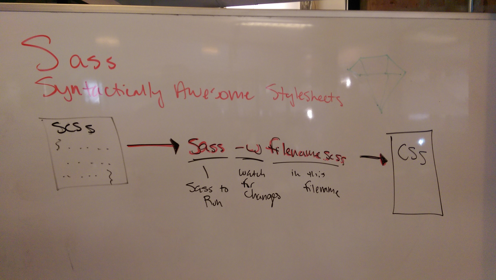
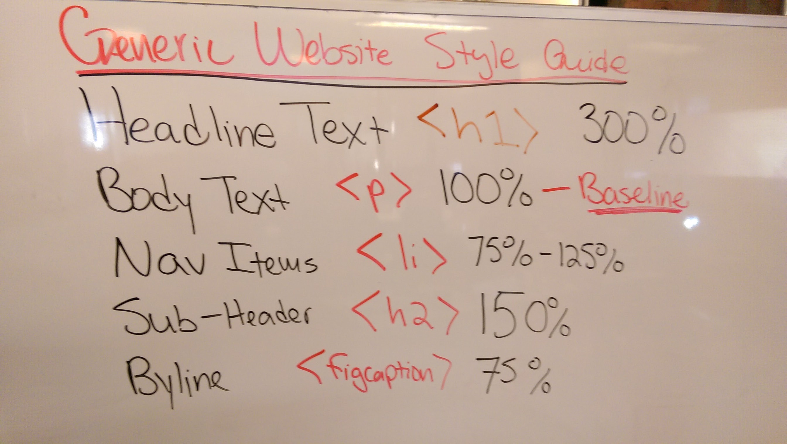
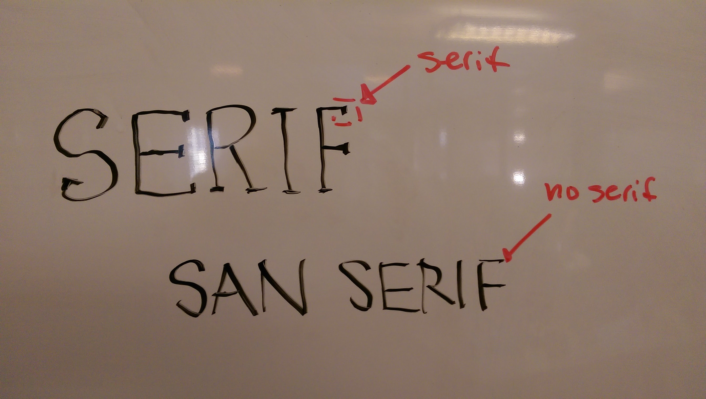
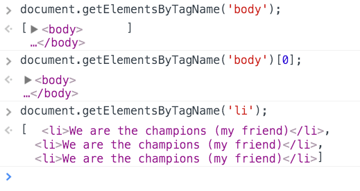

## 2.2 From Wireframe to Production

*The theme of today's class will be learning how to compose a website from scratch. We'll discuss a variety of standards to help build a layout. We'll then explore how to build wireframes, what to look out for, and consider a few examples from live websites. Finally, we'll build our own wireframe and by the evening we'll build out a basic layout.*

#### Sass

###### Learning Objectives

* Understand what a CSS pre-processor is
* Understand a strong use case for a CSS pre-processor
* Use Sass to include variables in your CSS
* Watch for changes in your Sass files and compile them to CSS

#### Advanced CSS Review

Let's review all the things from yesterday!

#### DOM Manipulation and Events

*We are going to dive right in to modifying the DOM based on user input.*

###### Learning Objectives
- Select DOM elements using `Document.querySelector()`
- Listen for user input with events
  * Mouse Input
  * Touch Input
  * Keyboard Input
- Modify DOM elements as a reaction to events
- Discuss Mutable vs Immutable

#### Lab: Wireframes and Mockups

###### Learning Objectives
- Understand the need for wireframes, mockups and MVPs
- Create your own wireframe for a two-column layout
- Polish a mockup after wireframe is completed
- Describe which wireframe elements will be DOM elements
