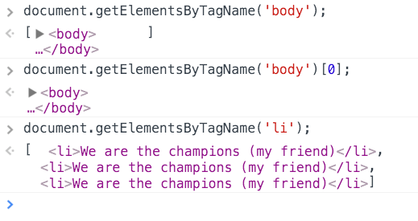

## 2.3 Creating User Interface Components

*We are going to continue working on the website that you wireframed and created today. We're going to look at creating front end elements that can be interactive. To accomplish this, we need to use Object-Oriented Javascript.*

#### Morning Exersize

- CSS Layouts (Redux)
- Classwide Q & A

#### DOM Manipulation and Events

*We are going to dive right in to modifying the DOM based on user input.*

###### Learning Objectives
- Select DOM elements using `Document.querySelector()`
- Listen for user input with events
  * Mouse Input
  * Touch Input
  * Keyboard Input
- Modify DOM elements as a reaction to events

#### UI Components

*We are going to build a component that is a form that accepts user input and monitors it.*

###### Learning Objectives
- Create a UI component using an Object
- Teach the component how to know about itself using `state`
- Modify `state` based on events

#### Blueprinting Objects with Constructors

*We will now dive into the heart of Object-Oriented programming.*

###### Learning Objectives
- Understand that you can create a blueprint of an Object
- Describe the word `instantiate`
- Create new `instances` of Objects
- Describe how Objects can communicate with other Objects.

#### Outcomes

###### Goals

- Introduction to the local job market and industry
- Create a job hunt workflow for outcomes in Trello

#### Lab/Homework: Add user input to your website
- 'Take what you have learned' - Yoda
- Tonight you need to add some form of user input to your website. This can be a game element, an interactive menu bar, etc.
- You should accomplish this by creating a component
- Use your newfound understanding of Constructors to build a blueprint for this component
- `instantiate` that component and verify that all input works
- In your `readme.md`, add a description of your UI Component's constructor and how it works
- `add`, `commit`, `push` to your repository and share the link to it in class
