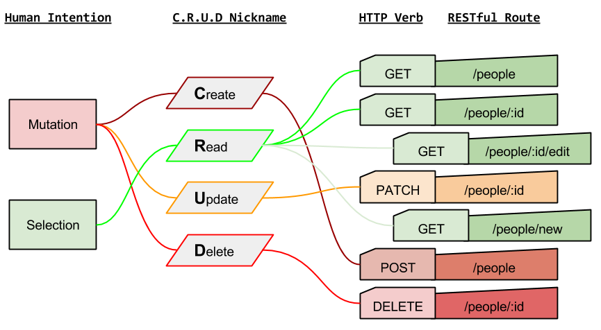

# Fullstack Sinatra

## Field Trips / Speakers!

On Thursday, we have the following events:

- 2pm in Classroom 1: State of Tech from  [https://www.illinoistech.org](https://www.illinoistech.org/)
- 4pm: Field Trip to [Razorfish](http://www.razorfish.com/) Chicago
- <iframe src="https://www.google.com/maps/embed?pb=!1m18!1m12!1m3!1d2970.208657416868!2d-87.63755318464463!3d41.88836947922136!2m3!1f0!2f0!3f0!3m2!1i1024!2i768!4f13.1!3m3!1m2!1s0x880e2cc8ca639c93%3A0x7772f132bee49f49!2sRazorfish!5e0!3m2!1sen!2sus!4v1458521387912" width="400" height="320" frameborder="0" style="border:0" allowfullscreen></iframe>

Before we build some full stack servers, let's review some HTTP!

## REST

Is a standard to work with APIs and other data sources.

* GET items
* GET items by an ID
* POST to CREATE a new item
* UPDATE an item by an ID
* DELETE an item by ID

We call this...

## **CRUD**

* Create
* Read
* Update
* Destroy

## HTTP Verbs

* GET - a web request that allows us to ... *GET* something
* POST - a web request to send something to POST (like Postal Service) -> sending something off!
* PUT or PATCH - a web request designed for *updating things*
* DELETE - a web request.... DESTROYSSSS!!! GODZILLA!!! ROAR

## HTTP Status Codes

* 404 - Not found
* 403 - Forbidden (aka your passwords sucks or is wrong or whatever)
* 500 - OH SH.... code or server broke!!!!
* 200 - OK - everything is good, everything loaded, f--- yeaaaa :)

## Bring it Together

