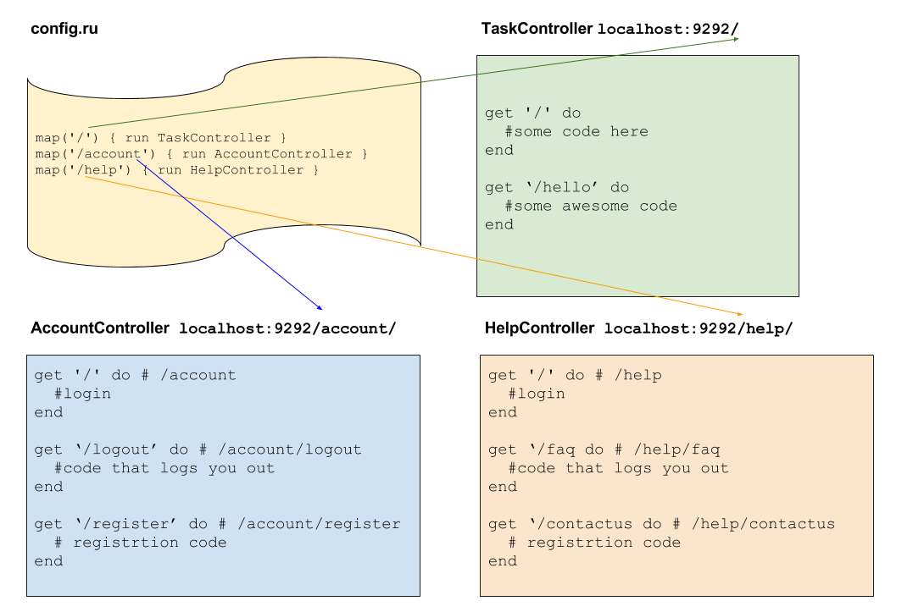

## Mapping Routes to Controllers

#### Diagram



#### Example Config

*config.ru*
```ruby
require 'sinatra/base'

require('./controllers/application') # /controllers/application.rb
require('./controllers/home') # /controllers/home.rb
require('./controllers/task') # /controllers/task.rb
require('./controllers/account') # /controllers/account.rb
require('./controllers/api') # /controllers/api.rb


## map resource to a controller
## http://localhost:9292/ <-- ROOT RESOURCE
## http://localhost:9292/task <-- some other resource
## http://localhost:9292/account <-- another resource

map('/') { run HomeController } # browse to localhost/
# get '/' do ... end  -> localhost/
# get '/meow' do ... end -> localhost/meow

map('/task') { run TaskController } # browse to localhost/task
# get '/' do ... end  -> localhost/task
# get '/meow' do ... end -> localhost/task/meow
# get '/create' do ... end -> localhost/task/create

map('/account') { run AccountController } # browse to localhost/account
# get '/' do ... end  -> localhost/account
# get '/meow' do ... end -> localhost/account/meow
# get '/create' do ... end -> localhost/account/create
# get '/register' do ... end -> localhost/account/register
# get '/task/account' do ... end ->

map('/api') { run ApiController } # browse to localhost/api
# get '/' do ... end  -> localhost/api
# get '/create' do ... end -> localhost/api/create
# get '/update' do ... end -> localhost/api/update
# get '/destroy' do ... end -> localhost/api/destroy

```
