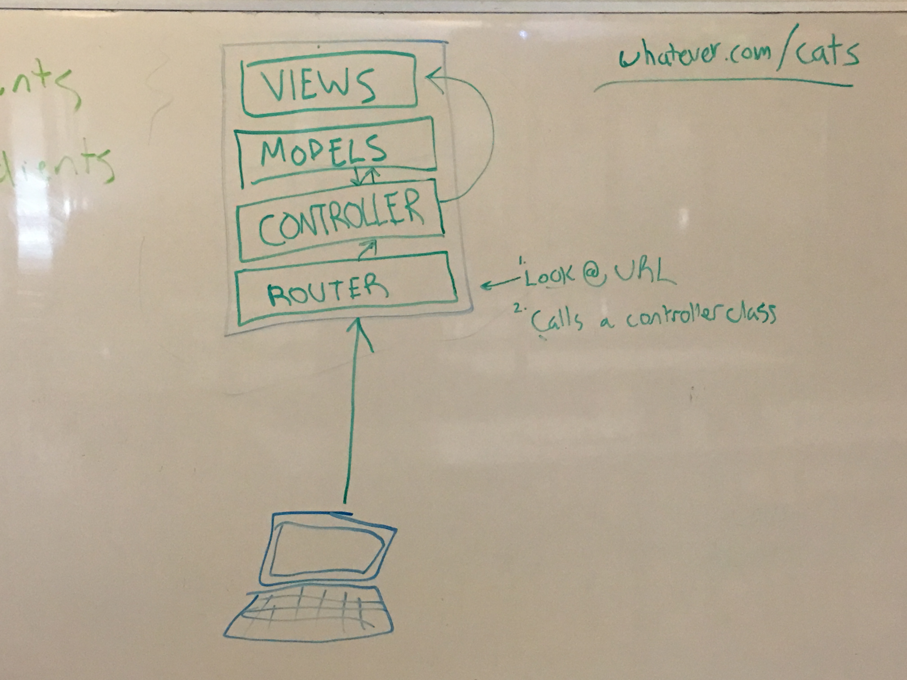

# MVC: The Complete Guide

> "Complete" as in "enough for you to get by"

The MVC design pattern is ubiquitous in web frameworks. They're going to be used by every web framework you use in this class including Sinatra, Ruby on Rails, Express, or even your own framework built directly on top of Rack.

MVC stands for __Model, View, Controller__. It's a concept that lets us organize our code into small pieces which each have their own responsibilities. Without MVC you'd end up with spaghetti code that was hard to read, maintain, and understand. At first, MVC seems like a lot of work for little benefit. As your applications grow larger the benefits of MVC become more apparent and you'll be glad you used it.

In this guide you'll learn:

- The benefits of MVC
- What is a model?
  - What is a model used for?
- What is a controller?
  - What are controllers used for?
- What is a template and what are they used for?

## Routing

The MVC design pattern leaves out the routing portion. If the acronym were more accurate it would be __R.C.M.V.__ (Router, Controller, Model, View). The router is where your application meets a user's web request. When you're running a local web server like the one's we're used to running with Sinatra (localhost:9292) and you type `http://localhost:9292/cats` into your browser's address bar the following information gets sent out to your web application:

- Headers (we'll talk about what these are another day)
- The domain name
- The port
- The path to the resource requested

That last one - the path to the resource requested - is the most important piece of information here. The application router reads the __path__ (which in this case is `/cats`) and then calls the controller class that is responsible for that path. You will have one or more controllers in your application. Each controller will have methods to handle each possible URL for your web app. If someone types in a URL that doesn't exist then you should have some sort of 404 error handler in one of your controllers.

__The router is responsible for calling the controller method that should handle a given URL__

## Controllers

Controllers are classes with methods responsible for handling requests to URLs in your web application. If someone were to go to `http://mysite.com/cats` the following happens:

1. The __Router__ picks up the URL parses out the path. In this case it's `/cats`
2. The router will find the right __Controller__ class for the `/cats` path and then call the correct method within that controller
3. The __Controller__ fires off whichever method needed to handle the request to `mysite.com/cats`

Controllers are the glue between models and views. The controller's job is to request data from a database and pass it to a view. A controller won't *always* need to request data from a database but they *will always return data back to the client in some form*. The controller will always return data to the client (browser or another computer program) in some form regardless of whether it used a model to fetch data from a database. Sometimes it gets returned as an HTML view and other times structured data like XML or JSON is sent (like when using APIs).

__Controllers are responsible for using models to get data that will populate and send views back to the browser. Controllers are the glue between models and views__

## Models

__Models__ are a programmatic representation of your data (usually in a database). For every __resource__ your application handles you'll have a __Model__ class for it.

For example, let's say you're building an inventory management application for the local corner store. Your application will likely need to store `products`, `users`, and `vendors`. Each of those resources will be stored in their own database table. A model maps the database data to a class.

Let's take the `products` resource for example. You'd likely have a `products` table that looks like this:

<table>
  <tr>
    <td>
      <table>
        <tr>
          <td><h3>Products</h3></td>
        </tr>
      </table>
    </td>
  </tr>
  <tr>
    <td>
      <table>
        <tr>
          <th>id</th>
          <th>name</th>
          <th>price</th>
          <th>in_stock</th>
        </tr>
        <tr>
          <td>1</td>
          <td>Gatorade Lemon Lime</td>
          <td>2.99</td>
          <td>237</td>
        </tr>
        <tr>
          <td>2</td>
          <td>Doritos Ranch Flavor</td>
          <td>1.79</td>
          <td>103</td>
        </tr>
      </table>
    </td>
  </tr>
</table>

For a table like this you would represent it in code like this:

```ruby
class Product < ORMClass::Base
  # The ORM class you use will take care
  # of reading the database tables and creating
  # getters and setters for the database tables you create
end
```

When building models you'll use an ORM (Object Relation Mapper) library that takes care of adding the correct attributes to your model classes. Basically, as long as you name your class the same as your database table (along with some other settings we won't get into here), the ORM library will set up a class that represents your database tables perfectly.

Once you've created a model you can work with your database using any language you want instead of having to write SQL by hand. For example, with our inventory database if you wanted to add a new product to the `products` table, instead of doing this...

```
# SQL written by hand. No need for this if you use a model class
INSERT INTO products(name, price, in_stock) VALUES('Doritos', 1.79, 103);
```

...you can do this:

```ruby
# Using a model class
Product.create name: 'Doritos', price: 1.79, in_stock: 103
```

__The model is responsible for CRUD operations on data. The model classes are responsible for creating, reading, updating, and deleting information from a database__

## Views

__Views__ are the final piece of the puzzle. They are template files that get filled in and sent to the browser. Your controller will request data from a model then pass that data into a view file. That view file will then be sent to your browser and rendered with all the spaces filled in.

A view is what's sent back to the client at the end of the request. Not all web applications have to send back HTML. Sometimes you'll need to respond to a request with XML or JSON. There are view templates you can use to send this structured data but normally when we talk about views we mean HTML templates.

__Views are the HTML templates that are rendered from a controller__

## MVC Overview/Recap

Check out the image for a diagram of how MVC works:

1. A request gets sent to your web application
2. The router sends the request to the correct controller method
3. The controller method will talk to any models it needs to
4. The controller will populate the view template with all the data it got (if it got any) and sends it back to the browser to be rendered


